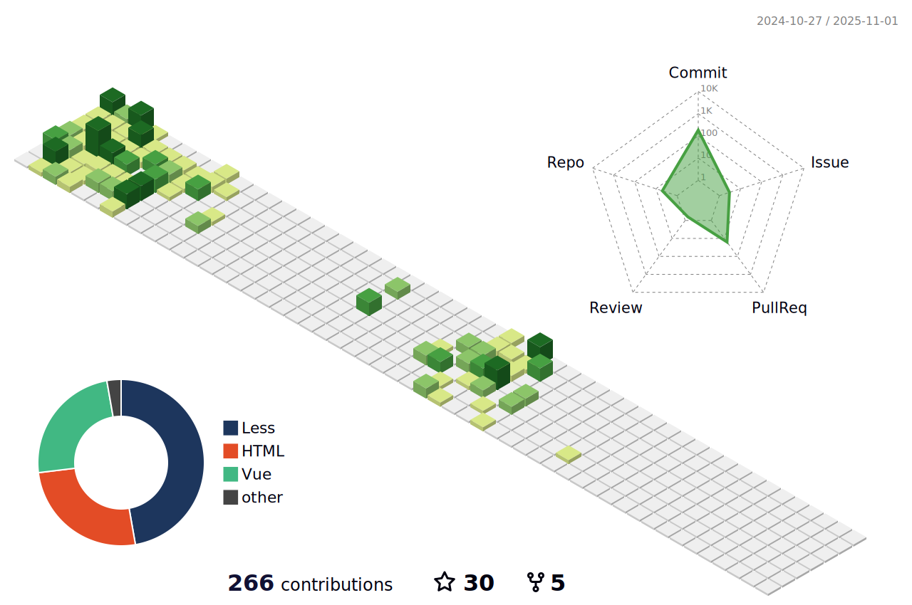

### 个人简介

- 一名简单的前端开发工程师，全栈转型中，半年内痛苦转型中。
- [点击这里](https://crazystudent13.cn/) 跳转到我的个人博客，这里记录着我这段时间的成长经历。

### 前端技能

1. 扎实的 H5，CSS3，JS 基础，熟悉页面架构和布局，能够完美页面还原
2. 丰富的 elementUI（2 和 3），同时熟悉 DataV+Echart 等数据大屏插件的使用
3. 熟练掌握 ES6, TS + Vue2/3 框架的使用以及相关的生态，并对 vue2/3 的源码底层有过一定研究
4. 熟悉前端开发中的各个工具链使用，熟悉 Vite 和 Webpack 的配置，使用过 Rollup 打包过工具库
5. 有良好的代码风格和编程习惯，有较强的 ESlint 规范，曾为公司团队制作过标准
6. 熟练使用前端流程管理工具 Git，Svn，同时制定过团队代码提交标准
7. 熟悉云效，`github`等平台的工作流使用
8. 熟悉使用 uni-app，有丰富的微信小程序兼容经验和 H5 端的通用开发
9. 能够部署 npm 私服，搭建项目模板和公司内部公用的项目组件库

### 后端技能

1. 熟悉使用`nestjs`框架进行后台接口的开发
2. 熟悉`mysql`的使用和`sql`的编写
3. 熟悉`redis`中间件的使用

---

### 提交记录

### views

